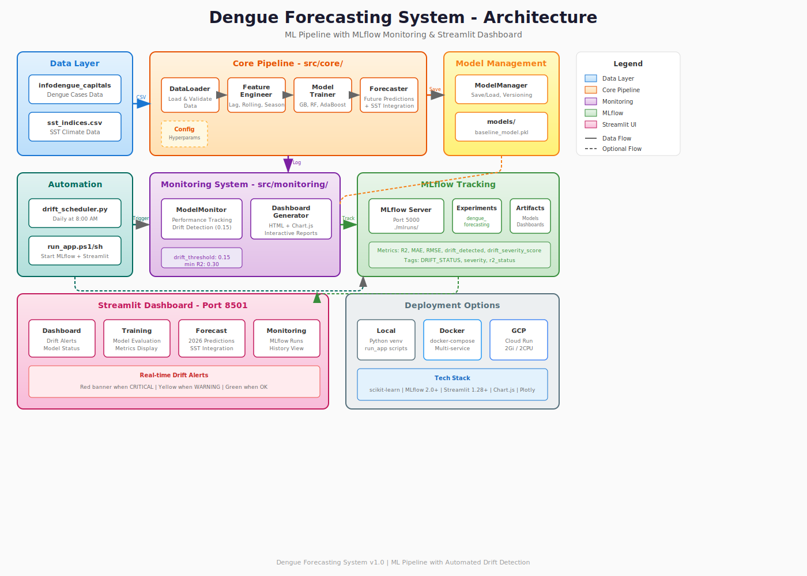

# Dengue Forecasting System

A production-ready machine learning system for dengue fever prediction using time series analysis, featuring **automated drift detection**, MLflow experiment tracking, and an interactive Streamlit interface.

[](https://www.python.org/downloads/)
[](https://mlflow.org/)
[](https://streamlit.io/)
[](https://www.docker.com/)

---

## Table of Contents

- [Features](#features)
- [Architecture](#architecture)
- [Quick Start](#quick-start)
- [Automated Drift Monitoring](#automated-drift-monitoring)
- [Usage Guide](#usage-guide)
- [Deployment](#deployment)
- [Configuration](#configuration)
- [API Reference](#api-reference)
- [Troubleshooting](#troubleshooting)
- [Development](#development)

---

## Features

### Core Capabilities
- **Multiple ML Models**: RandomForest, GradientBoosting, and AdaBoost with automatic best model selection
- **Automated Drift Detection**: Real-time monitoring with daily scheduled checks at 8:00 AM
- **Model Persistence**: Efficient pickle-based model storage for fast inference (15x faster than retraining)
- **Interactive UI**: Streamlit web application with 4 pages: Dashboard, Training, Forecast, Monitoring
- **Experiment Tracking**: Complete MLflow integration with run logging, metrics, and model registry
- **Production Ready**: Docker support, Google Cloud deployment scripts, and comprehensive monitoring

### Monitoring & Alerts
- **Scheduled Drift Checks**: Python `schedule` library runs checks daily at 8:00 AM automatically
- **Visual Alerts**: Red/yellow banners in Streamlit when drift detected
- **HTML Dashboards**: Interactive Chart.js visualizations in MLflow artifacts
- **Silent Training**: No plot pop-ups during training (`show_plots=False` by default)
- **Cross-platform**: Works on Windows, Linux, and Mac

---

## Architecture

### System Overview


### System Diagram (Interactive)





### File Structure

```
project_final/
├── src/
│   ├── core/                      # Core ML components
│   │   ├── data_loader.py         # Data validation & loading
│   │   ├── feature_engineer.py    # Feature creation (lags, rolling, seasonal)
│   │   ├── model_trainer.py       # Model training & evaluation
│   │   └── forecaster.py          # Future predictions
│   ├── monitoring/                # Drift detection & monitoring
│   │   ├── model_monitor.py       # Performance tracking, drift detection
│   │   └── drift_dashboard_generator.py  # HTML report builder
│   └── utils/                     # Utilities
│       ├── model_manager.py       # Model persistence
│       ├── config.py              # Hyperparameters & thresholds
│       └── visualizer.py          # Plotting (show_plots=False)
├── data/                          # Input datasets (CSV files)
├── models/                        # Trained models (pickle files)
├── mlruns/                        # MLflow tracking data
├── scripts/                       # Deployment & utility scripts
│   ├── drift_scheduler.py         # Automated daily drift checks
│   ├── run_app.ps1/sh             # Start MLflow + Streamlit
│   ├── deploy_gcp.ps1/sh          # Google Cloud deployment
│   └── test_drift_logging.py      # Manual drift check
### Deployment Workflow Comparison

| Workflow | Command | When to Use |
|----------|---------|-------------|
| **Train Only** | `python -m src.main` | Development, testing, manual control |
| **Train + Monitor** | `python -m src.main --start-scheduler` | Quick setup, automated workflows |
| **Separate Processes** | Terminal 1: `python -m src.main`<br>Terminal 2: `python scripts/drift_scheduler.py` | **Production** - independent processes |
| **Convenience Script** | `.\scripts\run_training_with_monitoring.ps1 -StartScheduler` | User-friendly, scripted deployments |
| **Docker Compose** | `docker-compose up -d` | Containerized production |
| **Cron Job** | `python scripts/drift_scheduler.py --run-once` | Scheduled batch processing |

### Data Flow                      # Streamlit web application
├── Dockerfile                     # Container definition
├── docker-compose.yml             # Multi-service orchestration
└── requirements.txt               # Python dependencies
```

### Data Flow

#### Training Flow
```
CSV Data → DataLoader → FeatureEngineer → ModelTrainer → ModelManager → models/
                                              ↓
                                         ModelMonitor → MLflow → Artifacts
```

#### Automated Drift Monitoring Flow
```
Scheduler (8am) → Load Baseline Model → Load Current Data → 
Predict → Calculate Metrics → Compare with Baseline → 
Log to MLflow → Generate Dashboard → Update Streamlit Alerts
```

#### Forecasting Flow
```
Trained Model + SST Data → Forecaster → Predictions → 
Visualizer (no pop-ups) → Streamlit Display
```

---

## Quick Start

### Option 1: Local Development

#### Prerequisites
- Python 3.11+
- pip or conda

#### Setup
```bash
# Clone repository
git clone <your-repo-url>
cd project_final

# Create virtual environment
python -m venv .venv

# Activate
.venv\Scripts\activate  # Windows
source .venv/bin/activate  # Linux/Mac

# Install dependencies
pip install -r requirements.txt

# Train baseline model
python -m src.main

# Launch application (MLflow + Streamlit)
.\scripts\run_app.ps1       # Windows PowerShell
./scripts/run_app.sh        # Linux/Mac
```

#### Access Points
- **Streamlit UI**: http://localhost:8501
- **MLflow UI**: http://localhost:5000

### Option 2: Docker (Recommended for Production)

#### Prerequisites
- Docker Desktop installed and running

#### Single Service
```bash
# Build image
docker build -t dengue-forecasting .

# Run Streamlit only
docker run -p 8501:8501 -v $(pwd)/models:/app/models dengue-forecasting

# Run MLflow only
docker run -p 5000:5000 -v $(pwd)/mlruns:/app/mlruns dengue-forecasting \
    mlflow ui --host 0.0.0.0 --port 5000 --backend-store-uri ./mlruns
```

#### Multi-Service with Docker Compose
```bash
# Start both services
docker-compose up -d

# View logs
docker-compose logs -f

# Stop services
docker-compose down
```

Access:
- **Streamlit**: http://localhost:8501
- **MLflow**: http://localhost:5000

### Option 3: Google Cloud Platform

#### Prerequisites
- gcloud CLI installed: https://cloud.google.com/sdk/docs/install
- GCP project with billing enabled
- Docker installed

#### Deploy to Cloud Run

**Linux/Mac:**
```bash
# Set your project ID
export GCP_PROJECT_ID="your-project-id"
export GCP_REGION="us-central1"

# Deploy
chmod +x scripts/deploy_gcp.sh
./scripts/deploy_gcp.sh
```

**Windows:**
```powershell
# Deploy
.\scripts\deploy_gcp.ps1 -ProjectId "your-project-id" -Region "us-central1"
```

The script will:
1. Enable required GCP APIs (Cloud Build, Cloud Run, Container Registry)
2. Build Docker image
3. Push to Google Container Registry
4. Deploy to Cloud Run with 2Gi/2CPU
5. Output the public URL

**Production Recommendations:**
- Use Cloud Storage for `mlruns/` and `models/`
- Set up Cloud SQL for MLflow backend store
- Implement authentication (Cloud IAM)
- Enable HTTPS with custom domain
- Set up Cloud Logging and Monitoring

---

## Automated Drift Monitoring

### Overview

The drift monitoring system runs automatically using the Python `schedule` library. **No manual intervention needed** - MLflow will be updated automatically on your chosen schedule.

### How It Works

1. **Schedule**: Configurable (daily, hourly, custom intervals)
2. **Process**:
   - Loads baseline model from `models/baseline_model.pkl`
   - Loads latest available data (auto-detects most recent year)
   - Makes predictions
   - Calculates metrics (R², MAE, RMSE)
   - Compares with baseline (threshold: 0.15 R² degradation)
   - Logs results to MLflow automatically
   - Writes alerts to `drift_alerts.log` if drift detected
3. **Output**: 
   - MLflow run created in `drift_check_{year}` experiment
   - HTML dashboard in artifacts
   - Metrics logged (drift_detected, r2_degradation, etc.)
   - Tags added (DRIFT_STATUS, severity, etc.)
   - Alert log file for notifications

### Setup & Usage

#### Option 1: Standalone Drift Monitoring

**Basic Usage:**
```bash
# Daily checks at 8am (default)
python scripts/drift_scheduler.py --interval daily

# Hourly checks
python scripts/drift_scheduler.py --interval hourly

# Every 6 hours
python scripts/drift_scheduler.py --interval 6h

# Every 30 minutes
python scripts/drift_scheduler.py --interval 30m

# Run once and exit (for cron jobs)
python scripts/drift_scheduler.py --run-once
```

**Help:**
```bash
python scripts/drift_scheduler.py --help
```

#### Option 2: Integrated Training + Monitoring

**Train and immediately start monitoring:**
```bash
# Train models, then start daily drift monitoring
python -m src.main --start-scheduler --scheduler-interval daily

# Train models, then start hourly drift monitoring
python -m src.main --start-scheduler --scheduler-interval hourly

# Train models, then check every 6 hours
python -m src.main --start-scheduler --scheduler-interval 6h
```

**Using convenience scripts:**

**Windows:**
```powershell
# Just train (no monitoring)
.\scripts\run_training_with_monitoring.ps1

# Train + start daily monitoring
.\scripts\run_training_with_monitoring.ps1 -StartScheduler -SchedulerInterval 'daily'

# Train + start hourly monitoring
.\scripts\run_training_with_monitoring.ps1 -StartScheduler -SchedulerInterval 'hourly'
```

**Linux/Mac:**
```bash
# Make executable
chmod +x scripts/run_training_with_monitoring.sh

# Just train (no monitoring)
./scripts/run_training_with_monitoring.sh

# Train + start daily monitoring
./scripts/run_training_with_monitoring.sh --start-scheduler --interval daily

# Train + start hourly monitoring
./scripts/run_training_with_monitoring.sh --start-scheduler --interval hourly
```

#### Option 3: Separate Processes (Recommended for Production)

Run training and monitoring in separate terminals for better control:

**Terminal 1 - Training:**
```bash
python -m src.main
```

**Terminal 2 - Monitoring:**
```bash
python scripts/drift_scheduler.py --interval daily
```

**Benefits:**
- Independent processes
- Can restart monitoring without retraining
- Better for production/Docker environments
- Easier debugging

#### Option 4: Cron Jobs (Linux/Mac)

```bash
# Run drift check daily at 8am
0 8 * * * cd /path/to/project_final && /path/to/python scripts/drift_scheduler.py --run-once

# Run drift check every 6 hours
0 */6 * * * cd /path/to/project_final && /path/to/python scripts/drift_scheduler.py --run-once
```

#### Check Results

**Via MLflow UI:**
```bash
# Start MLflow (if not running)
.\scripts\run_app.ps1

# Open http://localhost:5000
# Look for "drift_check_2025" experiment
```

**Via Streamlit App:**
```bash
# Start app (if not running)
.\scripts\run_app.ps1

# Drift alerts show automatically on Dashboard if detected
```

**Via Logs:**
The scheduler prints status to console:
```
[SCHEDULER] Starting drift check at 2026-02-02 08:00:00
[1/6] Loading baseline model...
[2/6] Initializing ModelMonitor...
[3/6] Loading current year data...
[4/6] Making predictions...
[5/6] Checking for drift (logging to MLflow)...
[6/6] Results:
   [OK] No drift detected
[SCHEDULER] Drift check completed at 2026-02-02 08:00:15
```

### Configuration

#### Schedule Intervals

The scheduler supports multiple interval formats:

| Interval | Command | Description |
|----------|---------|-------------|
| Daily | `--interval daily` | Every day at 08:00 |
| Hourly | `--interval hourly` | Every hour |
| Weekly | `--interval weekly` | Every Monday at 08:00 |
| Custom Hours | `--interval 6h` | Every 6 hours |
| Custom Minutes | `--interval 30m` | Every 30 minutes |

#### Change Default Time

Edit `scripts/drift_scheduler.py` for daily interval:
```python
# Change from 08:00 to 10:00
schedule.every().day.at("10:00").do(run_drift_check)
```

#### Change Drift Threshold

Edit `src/utils/config.py`:
```python
DRIFT_THRESHOLD = 0.15  # Change this (e.g., 0.10 stricter, 0.20 looser)
```

The threshold is automatically used by the scheduler.

#### Alert Notifications

The `send_drift_alert()` function in `scripts/drift_scheduler.py` logs to `drift_alerts.log` by default. Customize it to add:

```python
def send_drift_alert(reasons: list, metrics: dict, year: int):
    # Email notification
    send_email(
        to="team@example.com",
        subject=f"Model Drift Alert - Year {year}",
        body=f"Drift detected: {reasons}"
    )
    
    # Slack notification
    send_slack_message(
        channel="#ml-alerts",
        message=f"🚨 Drift detected in {year}: {reasons}"
    )
    
    # PagerDuty incident
    trigger_pagerduty_incident(
        severity="high",
        description=f"Model drift detected"
    )
```

### Running as Background Service

#### Windows (Task Scheduler)
```powershell
# Create scheduled task to run at startup
$action = New-ScheduledTaskAction -Execute "python.exe" -Argument "C:\path\to\scripts\drift_scheduler.py"
$trigger = New-ScheduledTaskTrigger -AtStartup
Register-ScheduledTask -TaskName "DengueDriftMonitor" -Action $action -Trigger $trigger
```

#### Linux/Mac (systemd)
```bash
# Create service file: /etc/systemd/system/drift-monitor.service
[Unit]
Description=Dengue Forecasting Drift Monitor
After=network.target

[Service]
Type=simple
User=youruser
WorkingDirectory=/path/to/project_final
ExecStart=/path/to/python scripts/drift_scheduler.py
Restart=always

[Install]
WantedBy=multi-user.target

# Enable and start
sudo systemctl enable drift-monitor
sudo systemctl start drift-monitor
sudo systemctl status drift-monitor
```

#### Docker
Add to `docker-compose.yml`:
```yaml
  drift-scheduler:
    build: .
    container_name: drift-scheduler
    command: python scripts/drift_scheduler.py
    volumes:
      - ./mlruns:/app/mlruns
      - ./models:/app/models
    networks:
      - dengue-network
    restart: unless-stopped
```

### Stopping the Scheduler

**Interactive mode:** Press `Ctrl+C`

**Background process (Windows):**
```powershell
Get-Process python | Where-Object {$_.CommandLine -like "*drift_scheduler*"} | Stop-Process
```

**Background process (Linux/Mac):**
```bash
pkill -f drift_scheduler.py
```

---

## Usage Guide

### Training Models

Train all models and select the best performer:
```bash
python -m src.main
```

This will:
- Load and preprocess dengue data from CSV files
- Create lag features, rolling averages, and seasonal features
- Train RandomForest, GradientBoosting, and AdaBoost
- Evaluate on test years (2023, 2025)
- Save best model as `models/baseline_model.pkl`
- Log all experiments to MLflow
- **No plot pop-ups** (controlled by `show_plots=False`)

### Monitoring for Drift

#### Automated (Streamlit)
1. Open Streamlit app at http://localhost:8501
2. Drift alerts appear automatically if detected
3. Click "Check Drift Details" for full analysis
4. View HTML dashboard in MLflow artifacts

#### Manual Testing
```bash
python scripts/test_drift_logging.py
```

This creates a drift check run in MLflow with:
- R² degradation metrics
- Severity assessment (CRITICAL/WARNING/OK)
- Interactive HTML dashboard with Chart.js
- Detailed JSON report

#### Automated Daily Checks
```bash
python scripts/drift_scheduler.py
```

Runs continuously with daily checks at 8:00 AM.

### Streamlit Interface

#### Pages
1. **Dashboard**: Overview, time series plots, drift alerts, feature importance
2. **Training**: Model evaluation, performance metrics, comparison charts
3. **Forecast**: Generate multi-quarter predictions for 2026
4. **Monitoring**: View MLflow experiments, drift history, detailed reports

#### Drift Alerts
- **Red banner** at top when drift detected (CRITICAL severity)
- **Yellow banner** for warnings
- **Sidebar indicator** on all pages
- Quick actions: "View in MLflow", "Check Drift Details"

### MLflow Tracking

#### View Experiments
```bash
# Local
http://localhost:5000

# Or start manually
mlflow ui --host 0.0.0.0 --port 5000 --backend-store-uri ./mlruns
```

#### Key Features
- Compare runs side-by-side
- View metrics history and charts
- Download model artifacts
- Access drift dashboards (HTML) in artifacts
- Filter by tags (e.g., `run_type = "drift_check"`)
- Search by model name or test year

---

## Deployment

### Local Development
```bash
# Setup
python -m venv .venv
.venv\Scripts\activate  # Windows
pip install -r requirements.txt

# Train
python -m src.main

# Run
.\scripts\run_app.ps1  # Windows
./scripts/run_app.sh   # Linux/Mac
```

### Docker Deployment

#### Build & Run
```bash
# Build
docker build -t dengue-forecasting .

# Run single service
docker run -p 8501:8501 -v $(pwd)/models:/app/models dengue-forecasting

# Or use docker-compose
docker-compose up -d
```

#### Configuration
- Memory: 2Gi (adjust in `docker-compose.yml`)
- CPU: 2 cores
- Ports: 8501 (Streamlit), 5000 (MLflow)
- Volumes: `./models`, `./mlruns` (persistent storage)

### Google Cloud Deployment

#### Prerequisites
```bash
# Install gcloud CLI
# https://cloud.google.com/sdk/docs/install

# Authenticate
gcloud auth login

# Set project
gcloud config set project YOUR_PROJECT_ID
```

#### Deploy
```bash
# Linux/Mac
export GCP_PROJECT_ID="your-project-id"
./scripts/deploy_gcp.sh

# Windows
.\scripts\deploy_gcp.ps1 -ProjectId "your-project-id"
```

#### Resources
- Memory: 2Gi
- CPU: 2
- Timeout: 300s
- Max instances: 10
- Min instances: 0 (scales to zero)

#### Production Setup
```bash
# Use Cloud Storage for persistence
gsutil mb gs://your-bucket-mlruns
gsutil mb gs://your-bucket-models

# Update docker-compose.yml or Dockerfile to use Cloud Storage
# Set MLflow tracking URI: gs://your-bucket-mlruns
```

---

## Configuration

### Model Hyperparameters

Edit `src/utils/config.py`:

```python
# Model parameters
GRADIENT_BOOSTING_PARAMS = {
    'n_estimators': 200,
    'max_depth': 4,
    'learning_rate': 0.05,
    'random_state': 42
}

RANDOM_FOREST_PARAMS = {
    'n_estimators': 200,
    'max_depth': 10,
    'min_samples_split': 5,
    'random_state': 42
}

ADABOOST_PARAMS = {
    'n_estimators': 100,
    'learning_rate': 0.05,
    'random_state': 42
}

# Monitoring thresholds
DRIFT_THRESHOLD = 0.15       # R² degradation threshold for drift
PERFORMANCE_THRESHOLD = 0.3  # Minimum acceptable R² score
```

### Feature Engineering

Edit `src/core/feature_engineer.py` to add/remove features:

```python
# Lag features (current: 1, 4, 8 quarters)
# Rolling averages (current: 4, 8 quarters)
# Seasonal features (current: quarter, year_sin, year_cos)
```

### Streamlit Configuration

Edit `app.py`:

```python
# Page layout
st.set_page_config(
    page_title="Dengue Forecasting",
    page_icon="📊",
    layout="wide"
)

# Cache settings
@st.cache_resource
def load_model():
    # Adjust TTL if needed
    pass
```

### Docker Resources

Edit `docker-compose.yml`:

```yaml
services:
  mlflow:
    deploy:
      resources:
        limits:
          cpus: '2'
          memory: 2Gi
  
  streamlit:
    deploy:
      resources:
        limits:
          cpus: '2'
          memory: 2Gi
```

---

## API Reference

### ModelManager

```python
from src.utils.model_manager import ModelManager

manager = ModelManager()

# Save baseline model
manager.save_baseline_model(
    model=trained_model,
    model_name='RandomForest',
    features=feature_list,
    metrics={'r2': 0.85, 'mae': 1000, 'rmse': 1500},
    test_year=2023,
    train_years=[2010, 2011, ..., 2022]
)

# Load baseline model
model, metadata = manager.load_baseline_model()
print(metadata['model_name'])  # 'RandomForest'
print(metadata['metrics'])     # {'r2': 0.85, ...}
print(metadata['features'])    # ['casos_est_lag_1', ...]

# Save versioned model
manager.save_model_with_timestamp(
    model=trained_model,
    model_name='GradientBoosting',
    features=feature_list,
    metrics=metrics_dict,
    test_year=2025,
    train_years=train_years
)
# Creates: models/GradientBoosting_2025_20260202_081530.pkl
```

### ModelMonitor

```python
from src.monitoring.model_monitor import ModelMonitor

# Initialize
monitor = ModelMonitor(
    experiment_name="dengue_forecasting",
    tracking_uri="./mlruns",
    drift_threshold=0.15
)

# Set baseline
monitor.set_baseline(
    metrics={'r2': 0.85, 'mae': 1000, 'rmse': 1500},
    model_name='RandomForest',
    test_year=2023
)

# Detect drift (auto-logs to MLflow)
drift_detected, reasons = monitor.detect_performance_drift(
    current_metrics={'r2': 0.70, 'mae': 1500, 'rmse': 2000},
    model_name='RandomForest',
    test_year=2025
)

if drift_detected:
    print(f"Drift detected! Reasons: {reasons}")
    # ['R² degraded by 17.6% (threshold: 15.0%)']

# Get metrics history
history_df = monitor.get_metrics_history()
print(history_df)
```

### Forecaster

```python
from src.core.forecaster import Forecaster
from src.core.feature_engineer import FeatureEngineer

engineer = FeatureEngineer()
forecaster = Forecaster(engineer)

# Generate forecast
forecast_df = forecaster.forecast_quarters(
    model=trained_model,
    historical_df=historical_data,
    feature_cols=feature_list,
    n_quarters=4,  # Forecast 4 quarters ahead
    year=2026
)

print(forecast_df)
# year_quarter  predicted_casos_est
# 2026Q1       15234.5
# 2026Q2       18567.2
# 2026Q3       21890.7
# 2026Q4       17234.1
```

---

## Troubleshooting

### Common Issues

#### 1. No baseline model found
```bash
# Error: FileNotFoundError: models/baseline_model.pkl not found

# Solution: Train the baseline model first
python -m src.main
```

#### 2. MLflow UI shows no experiments
```bash
# Check tracking URI
python -c "import mlflow; print(mlflow.get_tracking_uri())"
# Should output: ./mlruns or file:///.../mlruns

# Verify mlruns directory exists
ls mlruns/  # Linux/Mac
dir mlruns  # Windows

# If empty, train models to create experiments
python -m src.main
```

#### 3. Docker containers not starting
```bash
# Check logs
docker-compose logs

# Common issues:
# - Port conflict: Change ports in docker-compose.yml
# - Permission issues: chmod 777 mlruns models (Linux)
# - Memory limit: Increase in docker-compose.yml

# Rebuild
docker-compose down
docker-compose up --build
```

#### 4. Port already in use
```bash
# Find process using port
lsof -i :8501  # Mac/Linux
netstat -ano | findstr :8501  # Windows

# Kill process
kill -9 <PID>  # Mac/Linux
taskkill /PID <PID> /F  # Windows

# Or change port in docker-compose.yml
ports:
  - "8502:8501"  # Use 8502 instead
```

#### 5. GCP deployment fails
```bash
# Authenticate
gcloud auth login

# Set project
gcloud config set project YOUR_PROJECT_ID

# Enable APIs manually
gcloud services enable cloudbuild.googleapis.com
gcloud services enable run.googleapis.com
gcloud services enable containerregistry.googleapis.com

# Check billing
gcloud billing projects describe YOUR_PROJECT_ID
```

#### 6. Drift scheduler not working
```bash
# Check if baseline model exists
ls models/baseline_model.pkl

# Verify schedule library installed
pip install schedule

# Test manually first
python scripts/test_drift_logging.py

# Check logs in terminal where scheduler is running
python scripts/drift_scheduler.py
```

#### 7. Plots popping up during training
```bash
# Verify show_plots parameter
# In src/main.py, should have:
pipeline = DengueForecastingPipeline(
    enable_monitoring=True,
    show_plots=False  # This disables plots
)
```

#### 8. Streamlit not showing drift alerts
```bash
# Check MLflow has drift_check runs
# Open http://localhost:5000
# Look for "drift_check_2025" experiment

# Manually trigger drift check
python scripts/test_drift_logging.py

# Refresh Streamlit page
```

---

## Development

### Running Tests

```bash
# Drift detection test
python scripts/test_drift_logging.py

# Check MLflow data
python scripts/check_mlflow.py

# Test model training
python -m src.main

# Test drift scheduler (immediate run)
python scripts/drift_scheduler.py
# Press Ctrl+C after first run completes
```

### Adding New Features

#### 1. New Model
Edit `src/core/model_trainer.py`:
```python
def _initialize_models(self):
    return {
        'GradientBoosting': GradientBoostingRegressor(...),
        'RandomForest': RandomForestRegressor(...),
        'AdaBoost': AdaBoostRegressor(...),
        'XGBoost': XGBRegressor(...)  # Add new model
    }
```

#### 2. New Features
Edit `src/core/feature_engineer.py`:
```python
def create_features(self, df):
    # Add new feature
    df['new_feature'] = df['casos_est'].rolling(12).std()
    feature_cols.append('new_feature')
    return df, feature_cols
```

#### 3. New Streamlit Page
Edit `app.py`:
```python
def new_page():
    st.title("New Page")
    # Your content here

# Add to navigation
page = st.sidebar.radio("Navigate", [
    "Dashboard", "Training", "Forecast", "Monitoring", "New Page"
])

if page == "New Page":
    new_page()
```

#### 4. New Monitoring Metric
Edit `src/monitoring/model_monitor.py`:
```python
def detect_custom_drift(self, current_metrics):
    # Add custom drift detection logic
    custom_threshold = 0.20
    if current_metrics['custom_metric'] > custom_threshold:
        return True, ["Custom metric exceeded threshold"]
    return False, []
```

### Code Style

- **Follow SOLID principles**
- **Comments start with lowercase**
- **Use type hints**:
  ```python
  def function(param: str) -> Dict[str, Any]:
      pass
  ```
- **Document public methods**:
  ```python
  def method(self, param: int) -> bool:
      """
      brief description.
      
      args:
          param: parameter description
          
      returns:
          return value description
      """
      pass
  ```

### Performance Benchmarks

- Model training: ~30 seconds
- Drift detection: 2 seconds (with loaded model)
- Forecast generation: <1 second
- Streamlit page load: ~3 seconds
- MLflow query: <500ms

### Optimizations

- Model caching with `@st.cache_resource`
- Lazy loading of data in Streamlit
- Efficient pickle serialization
- Docker multi-stage builds
- No plot rendering during training (`show_plots=False`)

---

## Technology Stack

### Machine Learning
- **scikit-learn 1.0+**: RandomForest, GradientBoosting, AdaBoost
- **pandas 1.3+**: Data manipulation
- **numpy 1.21+**: Numerical operations

### Monitoring & Tracking
- **MLflow 2.0+**: Experiment tracking, model registry
- **schedule 1.2+**: Automated drift checks

### User Interface
- **Streamlit 1.28+**: Web application
- **Plotly 5.14+**: Interactive charts
- **Matplotlib 3.4+**: Static visualizations

### Deployment
- **Docker**: Containerization
- **docker-compose**: Multi-service orchestration
- **Google Cloud Run**: Serverless deployment

### Storage
- **Pickle**: Model serialization
- **SQLite**: MLflow backend (default)
- **CSV**: Data input/output

---

## Security Considerations

### Production Checklist

- [ ] Enable authentication for Streamlit (streamlit-authenticator)
- [ ] Enable authentication for MLflow (--auth-type basic)
- [ ] Use environment variables for secrets (.env file)
- [ ] Enable HTTPS (reverse proxy with nginx/Caddy)
- [ ] Set up firewall rules (restrict ports)
- [ ] Use Cloud Storage for artifacts (Google Cloud Storage/S3)
- [ ] Enable audit logging (Cloud Logging)
- [ ] Implement rate limiting (nginx)
- [ ] Regular security updates (dependabot)
- [ ] Use secrets manager (Google Secret Manager/AWS Secrets Manager)
- [ ] Set up monitoring alerts (Cloud Monitoring/CloudWatch)
- [ ] Backup mlruns and models regularly

### Environment Variables

Create `.env` file:
```bash
MLFLOW_TRACKING_URI=./mlruns
MLFLOW_USERNAME=admin
MLFLOW_PASSWORD=secure_password
GCP_PROJECT_ID=your-project-id
GCP_REGION=us-central1
```

Load in application:
```python
import os
from dotenv import load_dotenv

load_dotenv()
mlflow_uri = os.getenv('MLFLOW_TRACKING_URI')
```

---

## Contributing

1. Fork the repository
2. Create feature branch: `git checkout -b feature/amazing-feature`
3. Commit changes: `git commit -m 'Add amazing feature'`
4. Push to branch: `git push origin feature/amazing-feature`
5. Open Pull Request

### Guidelines
- Follow existing code style
- Add tests for new features
- Update documentation
- Keep commits atomic and well-described

---

## License

MIT License - see LICENSE file for details

---

## Support & Resources

### Documentation
- **MLflow**: https://mlflow.org/docs/latest/index.html
- **Streamlit**: https://docs.streamlit.io
- **scikit-learn**: https://scikit-learn.org/stable/documentation.html
- **Docker**: https://docs.docker.com/
- **Google Cloud Run**: https://cloud.google.com/run/docs

### Getting Help
- Open an issue on GitHub
- Check troubleshooting section above
- Review MLflow UI for experiment details
- Check container logs: `docker-compose logs`

---

## Acknowledgments

- **Data source**: InfoDengue Brazil (dengue case data)
- **ML frameworks**: scikit-learn, MLflow
- **UI framework**: Streamlit, Plotly
- **Deployment**: Docker, Google Cloud Platform
- **Scheduling**: Python schedule library

---

## Project Information

**Version**: 2.0.0  
**Last Updated**: February 2026  
**Python**: 3.11+  
**Status**: Production Ready  
**Features**: Automated Drift Monitoring, Multi-deployment Support, Real-time Alerts

---

## Quick Reference Card

### Essential Commands

```bash
# Local Development
python -m venv .venv
.venv\Scripts\activate  # Windows
pip install -r requirements.txt
python -m src.main
.\scripts\run_app.ps1  # Windows

# Docker
docker-compose up -d
docker-compose logs -f
docker-compose down

# Google Cloud
.\scripts\deploy_gcp.ps1 -ProjectId "your-project-id"

# Drift Monitoring
python scripts/drift_scheduler.py  # Automated daily checks
python scripts/test_drift_logging.py  # Manual test

# MLflow
mlflow ui --host 0.0.0.0 --port 5000 --backend-store-uri ./mlruns
```

### Access Points
- **Streamlit**: http://localhost:8501
- **MLflow**: http://localhost:5000

### Key Metrics
- **Drift threshold**: 0.15 (R² degradation)
- **Performance threshold**: 0.3 (minimum R²)
- **Memory**: 2Gi (Docker)
- **Ports**: 8501 (Streamlit), 5000 (MLflow)

### File Locations
- **Baseline model**: `models/baseline_model.pkl`
- **MLflow data**: `mlruns/`
- **Input data**: `data/infodengue_capitals_subsetBR.csv`, `data/sst_indices.csv`
- **Configuration**: `src/utils/config.py`
- **Scheduler**: `scripts/drift_scheduler.py`

---

**Built with ❤️ for production ML workflows**
